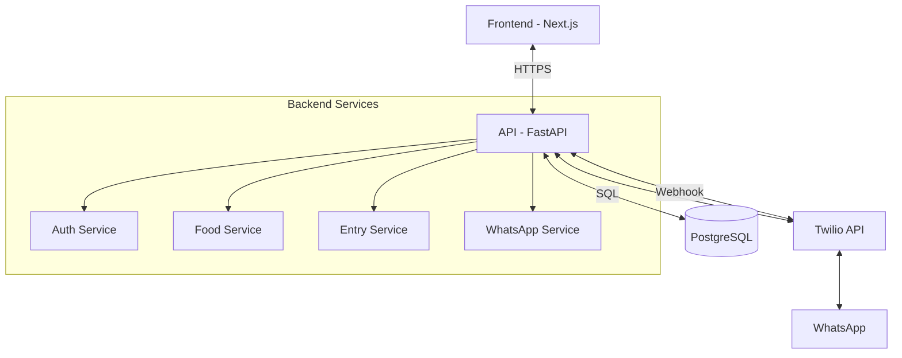

# Arquitetura do Sistema Diário Fit

## Visão Geral
O Diário Fit é uma aplicação web para controle de calorias com integração ao WhatsApp. A arquitetura segue os princípios de Clean Architecture e Domain-Driven Design (DDD) para garantir manutenibilidade e escalabilidade.

## Diagrama de Arquitetura

## Camadas da Aplicação

### 1. API (FastAPI)
- **Endpoints RESTful**
- **Autenticação JWT**
- **Validação de Dados** com Pydantic
- **Documentação Automática** com OpenAPI/Swagger

### 2. Serviços de Domínio
- **Auth Service**: Gerenciamento de usuários e autenticação
- **Food Service**: Catálogo de alimentos e informações nutricionais
- **Entry Service**: Registro de refeições e cálculos nutricionais
- **WhatsApp Service**: Processamento de mensagens via Twilio

### 3. Camada de Dados
- **SQLAlchemy** como ORM
- **PostgreSQL** como banco de dados principal
- **Alembic** para migrações
- **Redis** para cache (opcional, futuras melhorias)

### 4. Frontend (Next.js)
- **Páginas Estáticas** com renderização no servidor
- **Gerenciamento de Estado** com React Query
- **UI Componentes** com Shadcn/UI e Tailwind CSS
- **PWA** para experiência mobile

## Fluxo de Dados

1. **Autenticação**
   - Usuário faz login e recebe um JWT
   - Token é armazenado no cliente e enviado em cada requisição

2. **Registro de Refeição**
   - Usuário envia mensagem pelo WhatsApp
   - Twilio envia mensagem para o webhook
   - WhatsApp Service processa a mensagem
   - Entry Service registra a refeição
   - Resposta é enviada de volta ao usuário

3. **Dashboard**
   - Frontend busca dados da API
   - Dados são exibidos em gráficos e resumos
   - Atualizações em tempo real com SWR/React Query

## Decisões de Projeto

### Backend
- **FastAPI**: Performance assíncrona e tipagem estática
- **SQLAlchemy 2.0**: Suporte a async/await
- **Pydantic**: Validação de dados e serialização
- **JWT**: Autenticação stateless

### Frontend
- **Next.js 14**: App Router e Server Components
- **TypeScript**: Tipagem estática
- **Tailwind CSS**: Estilização utilitária
- **Shadcn/UI**: Componentes acessíveis

### Segurança
- **HTTPS** em produção
- **CORS** configurado
- **Rate Limiting**
- **Validação de Entrada**
- **Proteção contra SQL Injection**

## Melhorias Futuras
1. **Cache** com Redis
2. **Background Tasks** para processamento pesado
3. **WebSockets** para notificações em tempo real
4. **Testes de Carga**
5. **CDN** para assets estáticos
