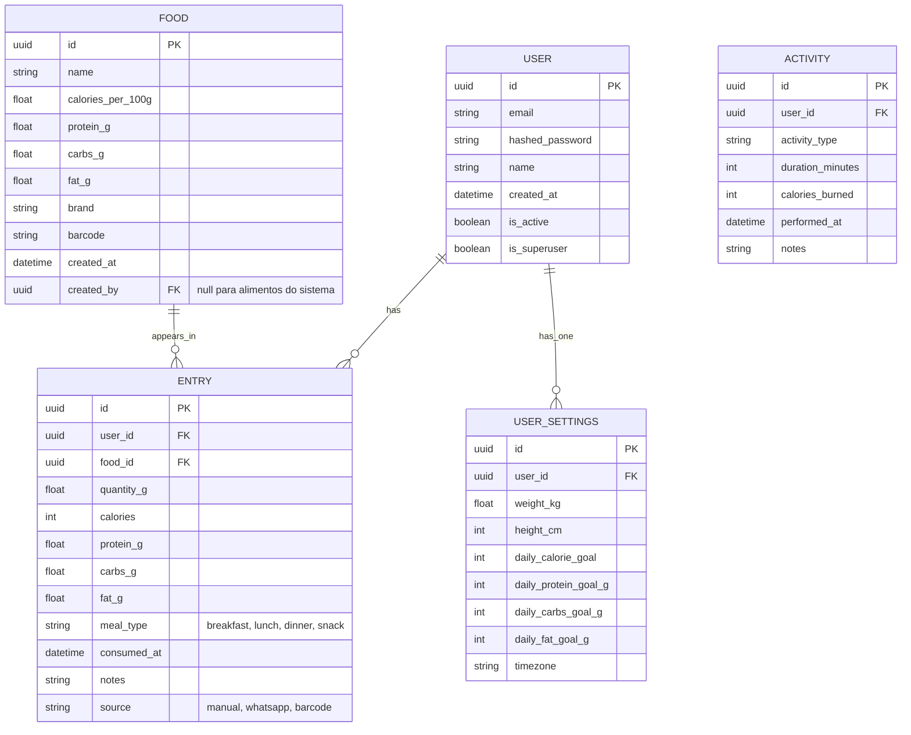

# Modelos de Dados

## Visão Geral
Este documento descreve os principais modelos de dados do sistema Diário Fit e seus relacionamentos.

## Diagrama Entidade-Relacionamento



## Descrição dos Modelos

### 1. Usuário (USER)
Armazena as informações básicas do usuário e credenciais de autenticação.

**Campos:**
- `id`: Identificador único (UUID)
- `email`: E-mail do usuário (único)
- `hashed_password`: Senha criptografada
- `name`: Nome completo
- `created_at`: Data de criação
- `is_active`: Conta ativa/inativa
- `is_superuser`: Acesso administrativo

### 2. Configurações do Usuário (USER_SETTINGS)
Armazena as preferências e metas do usuário.

**Campos:**
- `id`: Chave primária
- `user_id`: Referência ao usuário
- `weight_kg`: Peso em kg
- `height_cm`: Altura em cm
- `daily_*_goal`: Metas diárias de nutrientes
- `timezone`: Fuso horário do usuário

### 3. Alimento (FOOD)
Catálogo de alimentos com informações nutricionais.

**Campos:**
- `id`: Identificador único
- `name`: Nome do alimento
- `calories_per_100g`: Calorias por 100g
- `protein_g`: Proteínas por 100g
- `carbs_g`: Carboidratos por 100g
- `fat_g`: Gorduras por 100g
- `brand`: Marca (opcional)
- `barcode`: Código de barras (opcional)
- `created_by`: Usuário que cadastrou (null para alimentos do sistema)

### 4. Registro de Refeição (ENTRY)
Registra quando um alimento foi consumido.

**Campos:**
- `id`: Identificador único
- `user_id`: Referência ao usuário
- `food_id`: Referência ao alimento
- `quantity_g`: Quantidade em gramas
- `*_g`: Valores nutricionais calculados
- `meal_type`: Tipo de refeição
- `consumed_at`: Data/hora do consumo
- `source`: Origem do registro

### 5. Atividade Física (ACTIVITY)
Registra atividades físicas realizadas.

**Campos:**
- `id`: Identificador único
- `user_id`: Referência ao usuário
- `activity_type`: Tipo de atividade
- `duration_minutes`: Duração em minutos
- `calories_burned`: Calorias queimadas
- `performed_at`: Data/hora da atividade

## Relacionamentos

1. **Usuário → Registros de Refeição** (1:N)
   - Um usuário pode ter múltiplos registros de refeição
   - Exclusão em cascata: se um usuário for excluído, todos os seus registros também são

2. **Alimento → Registros de Refeição** (1:N)
   - Um alimento pode aparecer em múltiplos registros
   - Restrição de chave estrangeira: impede a exclusão de alimentos usados em registros

3. **Usuário → Configurações** (1:1)
   - Cada usuário tem exatamente um conjunto de configurações
   - Exclusão em cascata: se um usuário for excluído, suas configurações também são

## Índices

Os seguintes índices são recomendados para melhorar o desempenho:

```sql
-- Índices para consultas frequentes
CREATE INDEX idx_entry_user_date ON entry(user_id, consumed_at);
CREATE INDEX idx_food_name ON food(name);
CREATE INDEX idx_activity_user_date ON activity(user_id, performed_at);

-- Índices únicos
CREATE UNIQUE INDEX idx_user_email ON "user"(email);
CREATE UNIQUE INDEX idx_user_settings_user ON user_settings(user_id);
```

## Considerações de Segurança

1. **Dados Sensíveis**
   - Senhas são armazenadas usando hash bcrypt
   - Dados pessoais devem ser criptografados em repouso

2. **Acesso**
   - Usuários só podem acessar/editar seus próprios dados
   - Apenas administradores podem gerenciar alimentos do sistema

3. **Backup**
   - Backup diário do banco de dados
   - Retenção de 30 dias de backups
