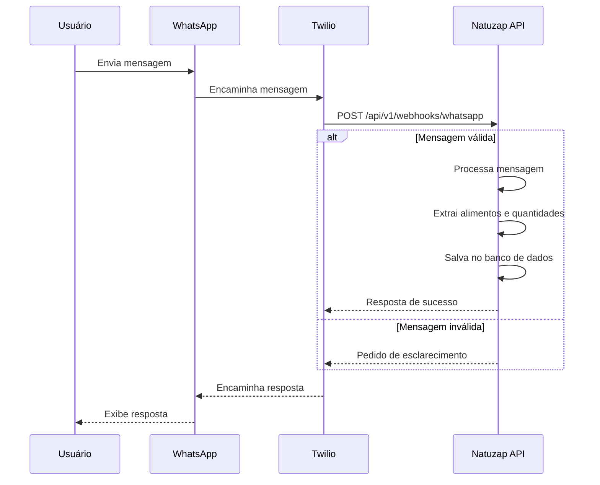

# Integração com WhatsApp

## Visão Geral
Este documento descreve o fluxo de integração com o WhatsApp usando a API da Twilio, incluindo o processamento de mensagens e respostas automáticas.

## Fluxo de Mensagens



## Padrões de Mensagem Suportados

### 1. Registro Simples de Alimento
```
[quantidade][unidade] de [alimento] no [refeição]
```
**Exemplos:**
- "200g de arroz no almoço"
- "1 banana no lanche"
- "2 fatias de pão integral no café da manhã"

### 2. Múltiplos Alimentos
```
[quantidade][unidade] de [alimento] e [quantidade][unidade] de [alimento] no [refeição]
```
**Exemplo:**
"100g de frango e 200g de batata doce no almoço"

### 3. Atividade Física
```
Atividade: [atividade] por [tempo] minutos
```
**Exemplo:**
"Atividade: corrida por 30 minutos"

## Processamento de Mensagens

### 1. Análise Léxica
- Divide a mensagem em tokens
- Identifica números e unidades (g, kg, ml, etc.)
- Identifica palavras-chave ("de", "no", "e", "por")

### 2. Extração de Entidades
- **Alimentos**: Busca no banco de dados por correspondências aproximadas
- **Quantidades**: Converte para gramas quando necessário
- **Refeições**: Mapeia para (café da manhã, almoço, jantar, lanche)

### 3. Validação
- Verifica se os alimentos existem no banco
- Confirma quantidades razoáveis
- Sugere correções para erros comuns

## Exemplos de Respostas

### Sucesso
```
✅ Registrado com sucesso!

🍽️ Almoço
- 200g Arroz integral (260 kcal)
- 150g Feijão (165 kcal)
- 100g Frango (165 kcal)

📊 Total: 590 kcal
🔥 Restante hoje: 1,610/2,200 kcal
```

### Esclarecimento Necessário
```
🤔 Não tenho certeza sobre "peito de frago". Você quis dizer:

1. Peito de frango grelhado
2. Peito de frango à milanesa
3. Outro alimento

Responda com o número correspondente.
```

### Erro
```
❌ Não consegui entender sua mensagem. Por favor, use um destes formatos:

• "200g de arroz no almoço"
• "1 banana no lanche"
• "Atividade: corrida por 30 minutos"
```

## Implementação Técnica

### Endpoint do Webhook
```python
@router.post("/webhooks/whatsapp")
async def whatsapp_webhook(
    request: Request,
    background_tasks: BackgroundTasks,
    twilio_signature: str = Header(None, alias="X-Twilio-Signature"),
):
    # 1. Validar assinatura da Twilio
    if not validate_twilio_request(request, twilio_signature):
        raise HTTPException(status_code=403, detail="Invalid signature")
    
    # 2. Processar formulário
    form_data = await request.form()
    from_number = form_data.get("From")
    message_body = form_data.get("Body", "").strip()
    
    # 3. Processar em segundo plano
    background_tasks.add_task(
        process_whatsapp_message,
        phone_number=from_number,
        message=message_body
    )
    
    # 4. Resposta imediata
    return Response(
        content='<?xml version="1.0" encoding="UTF-8"?><Response></Response>',
        media_type="application/xml"
    )
```

### Processamento Assíncrono
```python
async def process_whatsapp_message(phone_number: str, message: str):
    # 1. Identificar usuário
    user = await get_user_by_phone(phone_number)
    if not user:
        await send_whatsapp_message(phone_number, "❌ Cadastro não encontrado. Por favor, use o app primeiro.")
        return
    
    # 2. Processar mensagem
    try:
        result = await process_food_entry(user.id, message)
        response = format_success_response(result)
    except AmbiguousFoodError as e:
        response = format_ambiguous_food_response(e.options)
    except Exception as e:
        logger.error(f"Error processing message: {str(e)}")
        response = format_error_response()
    
    # 3. Enviar resposta
    await send_whatsapp_message(phone_number, response)
```

## Segurança

1. **Validação de Requisições**
   - Verificar assinatura da Twilio em todas as requisições
   - Validar formato do número de telefone
   
2. **Limites de Taxa**
   - Implementar rate limiting por número de telefone
   - Bloquear números com comportamento suspeito
   
3. **Privacidade**
   - Não armazenar mensagens brutas após o processamento
   - Registrar apenas os dados estruturados necessários
   
4. **Conformidade**
   - Seguir as políticas da Twilio e WhatsApp Business
   - Fornecer opção de cancelamento de assinatura

## Testes

### Cenários de Teste
1. **Mensagens Válidas**
   - Verificar processamento correto de quantidades e unidades
   - Confirmar cálculo preciso de calorias
   
2. **Mensagens Ambíguas**
   - Testar reconhecimento de alimentos similares
   - Verificar sugestões de correção
   
3. **Mensagens Inválidas**
   - Testar formatos incorretos
   - Verificar mensagens de erro claras

### Ferramentas de Teste
- **ngrok**: Para testar webhooks localmente
- **Twilio Sandbox**: Ambiente de testes sem custo
- **Testes Automatizados**: Usando pytest e respostas HTTP simuladas
